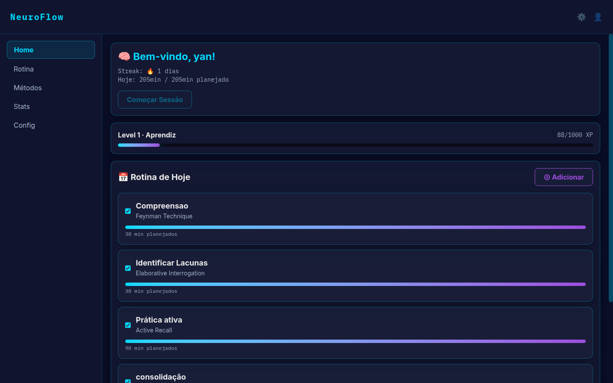
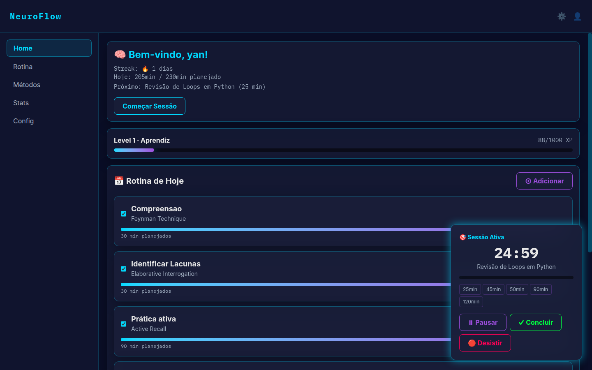
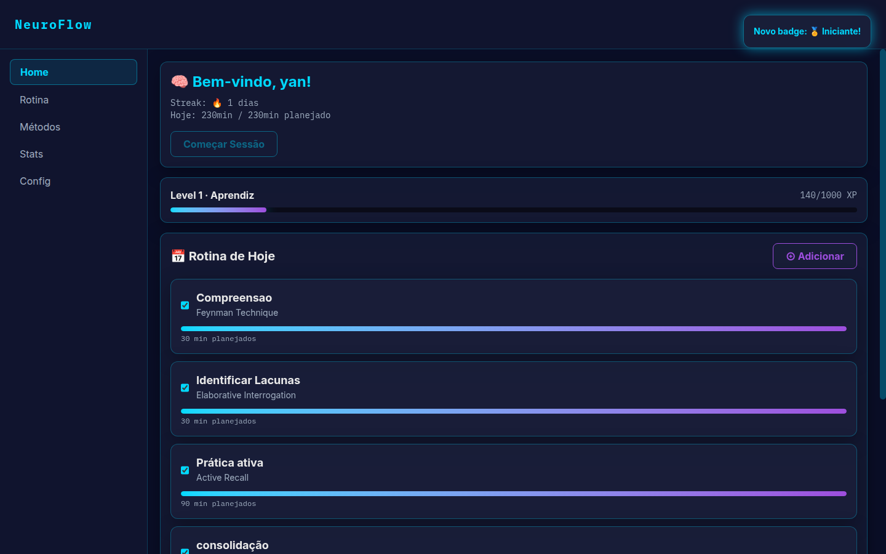
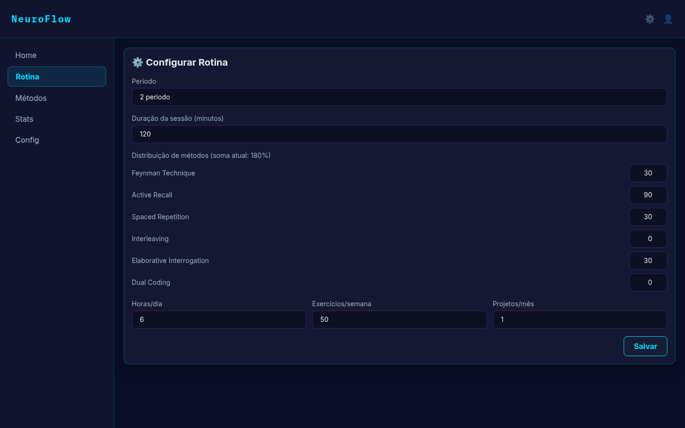
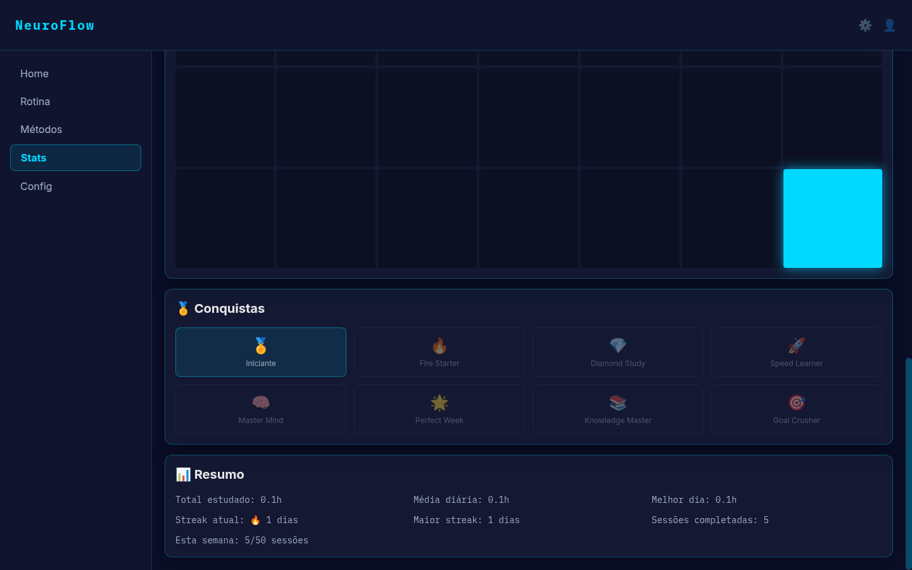
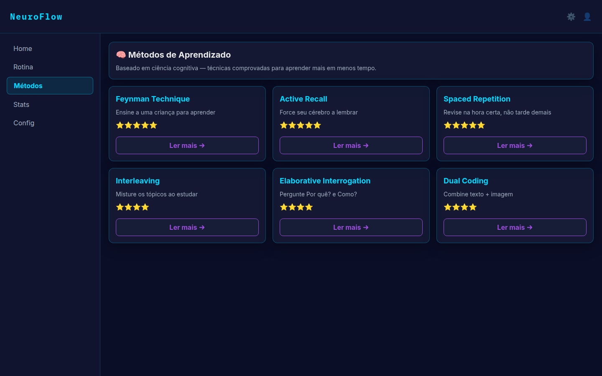
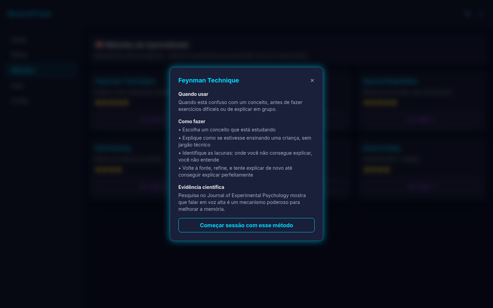
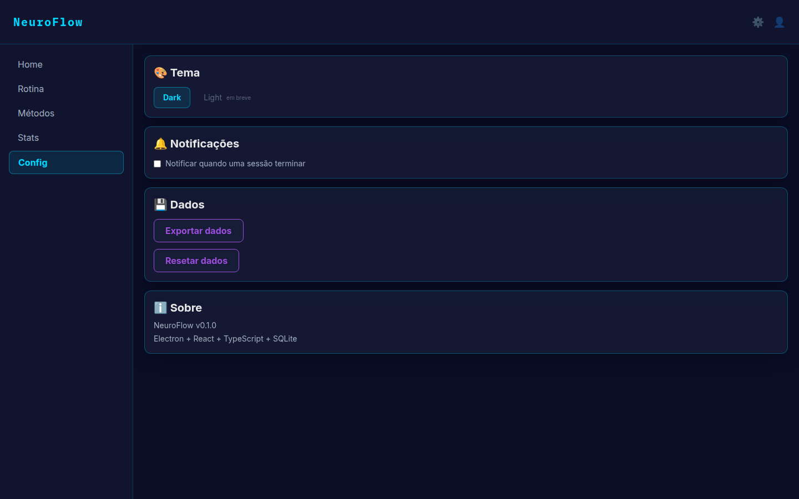

# 🧠 NeuroFlow

**Rastreador de rotina de estudos baseado em ciência cognitiva**, com timer de sessões, gamificação (XP, níveis e badges) e estatísticas — construído como app desktop nativo com Electron, React e SQLite.


---

## 📖 Sobre o projeto

O NeuroFlow nasceu de uma pergunta simples: **por que a maioria dos apps de produtividade ignora décadas de pesquisa em ciência cognitiva?** Em vez de só uma lista de tarefas com timer, o app é construído em torno de técnicas comprovadas — *Active Recall*, *Spaced Repetition*, *Feynman Technique*, *Interleaving* — e transforma cada sessão de estudo em progresso mensurável: XP, streaks, níveis e conquistas.

É um projeto full-stack desktop completo: banco de dados local, processos separados (main/renderer) comunicando via IPC tipado, uma camada de agregação estatística feita em SQL puro, e um sistema de gamificação com regras de negócio reais (não é só decoração).

## ✨ Funcionalidades

### 📅 Dashboard & Timer
- Rotina diária com tarefas, progresso e método de estudo associado
- Timer de sessão flutuante (Pomodoro ou customizado), com chips de duração configuráveis
- Marcação de conclusão com cálculo automático de tempo e XP

### 🎮 Gamificação
- Sistema de XP e níveis (com título por nível — ex: *"Programador Júnior"*)
- Streak de dias consecutivos de estudo (atual e recorde)
- 8 badges/conquistas com condições reais de desbloqueio (primeira sessão, streak de 10 dias, uso de todos os métodos, meta diária batida 3x, etc.) e toast de celebração ao desbloquear

### 📊 Estatísticas
- Gráfico de horas estudadas nos últimos 7 dias
- Breakdown de uso por método de estudo (realizado vs. meta configurada)
- Calendário de streak (estilo *contribution graph*, 6 semanas)
- Resumo: total de horas, média diária, melhor dia, sessões completadas

### 🧠 Métodos de Aprendizado
- Galeria educacional com as 6 técnicas de estudo baseadas em ciência cognitiva, cada uma com: quando usar, como aplicar em passos, e evidência científica
- Botão de início rápido: cria uma tarefa com o método selecionado e já inicia a sessão

### ⚙️ Rotina & Configurações
- Configuração de período, duração de sessão, distribuição de métodos e metas (horas/dia, exercícios/semana, projetos/mês)
- Notificações (ativar/desativar), exportação de dados para JSON, e reset completo com confirmação

## 📸 Screenshots

| Dashboard | Sessão ativa |
|---|---|
|  |  |

| Badge desbloqueado | Configurar rotina |
|---|---|
|  |  |

| Estatísticas & Conquistas | Galeria de métodos |
|---|---|
|  |  |

| Detalhe de método | Configurações |
|---|---|
|  |  |

## 🏗️ Arquitetura

Electron com processos main/renderer isolados (`contextIsolation` + `sandbox` ativados) e um padrão de camadas consistente em todo o backend:

```
Renderer (React)  →  window.api (preload/contextBridge)  →  IPC handlers  →  Repositories (SQL)
```

- **`src/main/db/*.repository.ts`** — acesso ao SQLite via `better-sqlite3`, sem ORM/query builder. Cada domínio (users, tasks, sessions, routines, stats, achievements, app) tem seu repository próprio.
- **`src/main/ipc/*.handlers.ts`** — handlers finos que só expõem os repositories via `ipcMain.handle`.
- **`src/preload/index.ts`** — ponte tipada (`contextBridge`) entre o processo isolado do renderer e o main.
- **`src/shared/types.ts`** — contrato único (`Api` interface) compartilhado entre main e renderer, garantindo type-safety de ponta a ponta.
- **`src/renderer/src/store/*`** — estado do cliente em Zustand (sem Redux/Context), um store pequeno por domínio (timer, tarefas, usuário, navegação, toast).

Sessões de estudo, XP, streak e desbloqueio de badges são calculados **atomicamente numa única transação SQLite** (`db.transaction`) ao concluir uma sessão — sem race conditions entre o progresso do usuário e as conquistas.

## 🛠️ Stack técnica

| Camada | Tecnologia |
|---|---|
| Desktop shell | Electron 44 |
| UI | React 19 + TypeScript 7 |
| Estilo | Tailwind CSS 4 + Framer Motion |
| Estado | Zustand |
| Banco de dados | SQLite (better-sqlite3, WAL mode) |
| Build | electron-vite + Vite 7 |
| Empacotamento | electron-builder (AppImage) |

## 🚀 Rodando localmente

### Pré-requisitos
- Node.js 20+
- Linux (build empacotado testado como AppImage — o app roda em modo dev em qualquer plataforma suportada pelo Electron)

### Instalação

```bash
git clone https://github.com/yangabriel-dev/NeuroFLow.git
cd NeuroFLow
npm install
```

### Modo desenvolvimento

```bash
npm run dev
```

Abre o app com hot-reload. O banco SQLite é criado automaticamente em `~/.config/NeuroFlow/neuroflow.db` na primeira execução.

### Verificação de tipos

```bash
npm run typecheck
```

### Build empacotado (Linux/AppImage)

```bash
npm run dist:linux
```

Gera `dist-electron/NeuroFlow-<versão>.AppImage`, pronto para distribuir — basta dar permissão de execução e rodar:

```bash
chmod +x dist-electron/NeuroFlow-*.AppImage
./dist-electron/NeuroFlow-*.AppImage
```

## 📁 Estrutura do projeto

```
src/
├─ main/                 # processo principal do Electron
│  ├─ db/                # conexão SQLite, migrations e repositories
│  └─ ipc/                # handlers IPC (um por domínio)
├─ preload/              # ponte contextBridge (window.api)
├─ renderer/src/
│  ├─ components/        # UI reutilizável (Card, Modal, NeonButton, ...)
│  ├─ pages/             # Home, Routine, Stats, Methods, Settings
│  ├─ store/             # estado Zustand por domínio
│  └─ constants/         # métodos de estudo, títulos de nível, etc.
└─ shared/types.ts       # contrato de API compartilhado main ↔ renderer
```

## 🗺️ Roadmap

O que já está pronto (4 fases de desenvolvimento incremental, cada uma commitada separadamente) e o que fica como próximo passo natural:

- [x] MVP: dashboard, timer, CRUD de tarefas
- [x] Navegação real, configuração de rotina, estatísticas, sistema de XP/nível
- [x] Badges/conquistas e tela de configurações completa
- [x] Galeria de métodos, polimentos visuais e build empacotado
- [ ] Modo claro (a paleta hoje é 100% dark/neon por design)
- [ ] Notificações nativas do sistema operacional (hoje usa Web Notifications)
- [ ] Build para Windows e macOS
- [ ] Importação de backups (hoje só exporta)

## 👤 Autor

**Yan Gabriel** — [github.com/yangabriel-dev](https://github.com/yangabriel-dev)

---

<sub>Desenvolvido com apoio de IA (Claude Code) como par de programação — da concepção ao empacotamento final.</sub>
